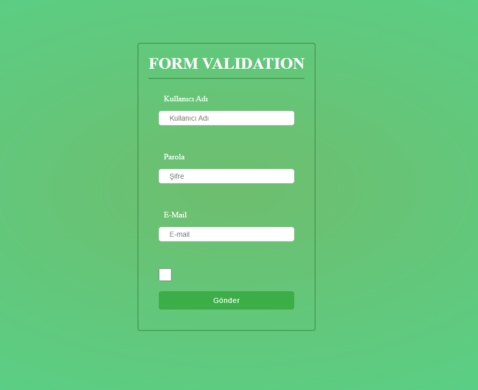
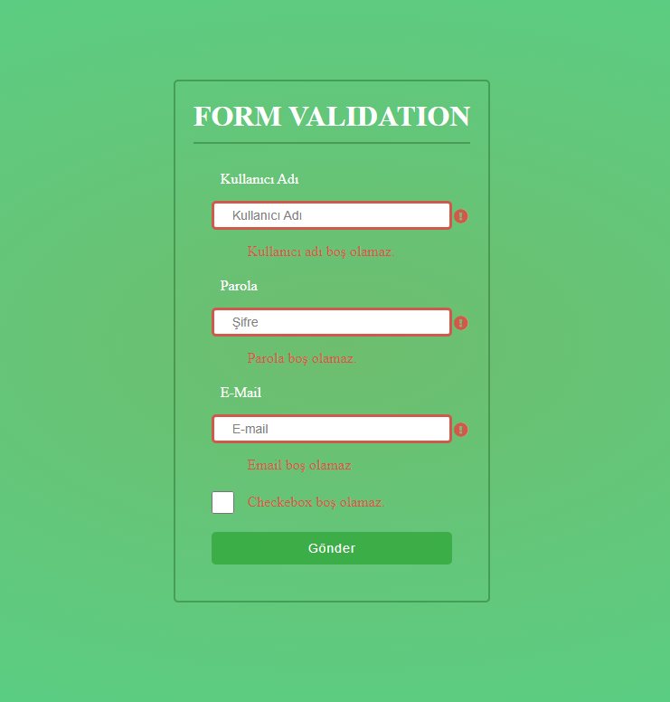

# ÖDEV-3

## Kurallar
1- Kullanıcı Adı, Şifre ve Email boş olduğunda hata verecek.

2- Şifre minimum 8 karakter olacak.

3- Email'de @ kullanılmaz ise hata verecek

4- Tüm hatalar input'a özel alanlarda gösterilecek ve hata mesajları o alana özel olacak.

5- Gönder butonuna tıklandığında eğer inputlar boş ise hata verilecek ve doldurulan inputın altındaki hata dinamik olarak yok edilecek.

